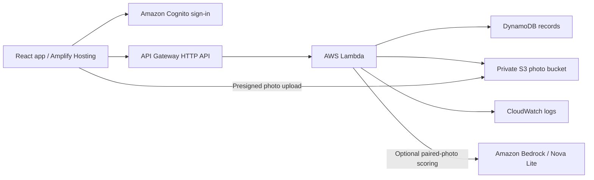

# MessWise

A small food-waste log for a campus mess: turn the daily published waste figure, menu, and supporting photos into a record that staff can review and act on.

The three-day scope is one mess. Daily kilograms are the main measure; photos add context and are never used to estimate grams. Sample records are illustrative, not field results.

## Run locally

Use Node.js 22 or later and npm. From the project directory:

```powershell
npm install
npm run dev
```

Open the local URL printed by Vite. Local mode works without AWS configuration and stores data in this browser. Clearing site data removes local records/photos; local storage is not shared across devices.

```powershell
npm test
npm --prefix backend install
npm run test:backend
npm run build
npm run preview
```

These are commands for reproducing the checks, not a claim that a cloud deployment has passed them.

For website-only AWS deployment, run `npm run package:aws`. It creates ready-to-upload Lambda, CloudFormation, and Amplify files in `.artifacts/aws/`. Follow the [console deployment steps](docs/AWS_DEPLOYMENT.md#website-only-deployment). Rebuild the frontend after setting the real AWS identifiers.

## Collect only what is available

| Field | What to record |
| --- | --- |
| Date and waste kg | Copy the mess's posted figure and attach its source photo when available. |
| Menu | The food served during the period covered by the figure. |
| Coverage and scope | Which meals are included; plate waste, kitchen waste, combined waste, or unconfirmed. |
| Attendance, optional | Meals served during the same covered meals. Leave blank if only enrolment is known. |
| Plate photos, optional | Friends' consented photos and feedback. Three photos are examples, not a representative survey. |
| Action | A proposed change, its status, and a follow-up note. |

Attendance is optional. Grams per meal served is `waste kg × 1000 ÷ meal servings`; registered students are a different denominator and must not be entered as meals served. Missing attendance suppresses the per-meal metric. Compare measurements only when their coverage and scope match.

### Linked weekly menu

The user-supplied [Tikmit menu for 5–11 October 2026](https://tikmit.com/week/full?id=2026-10-05_to_2026-10-11), labelled **Food Court 2**, is included as a dated snapshot in `src/data/weekly-menu.json`. New daily entries fill breakfast, lunch, snacks, and dinner for the selected date. Check actual service and edit substitutions. Date changes update untouched fields; edited fields and existing saved menus are preserved. **Use published menu** explicitly replaces the four menu fields. Dates outside this week get no imported dishes, and the snapshot does not refresh automatically.

The plate-pair form offers menu choices for its selected date and meal, with listed alternatives separated. Nothing is preselected: choose only the dishes actually served on that plate, up to eight, or enter substitutions manually. Menus never create waste measurements or plate observations. The source URL, data URL, retrieval time, and bundle generation time are retained with the snapshot. The menu provider is credited in `THIRD_PARTY_NOTICES.md`.

Daily waste cannot be attributed to a particular dish from a daily menu alone. A before/after change is an observation, not evidence that an action caused a reduction. The app does not calculate money, carbon, compost, or biogas savings from unverified factors. Recording amounts and reasons is consistent with [EPA food-waste assessment guidance](https://www.epa.gov/sustainable-management-food/tools-preventing-and-diverting-wasted-food).

## Optional plate pilot

**Plate pilot** stores before/after photo pairs separately from daily measurements. Two people rate each served dish in quarter steps (or "cannot assess") before an optional Amazon Bedrock request. Human ratings are locked, the model receives no human scores or student feedback, and a second run checks repeatability. The evaluation reports plate and dish counts, exact/within-step agreement, and excluded unclear observations. Local mode supports the collection and human-review flow; Bedrock requires the AWS deployment.

Start with five pairs. See the [pilot protocol and evaluation guide](docs/PLATE_PILOT.md). Scores are experimental visual estimates and do not produce grams. JSON exports contain ratings and model provenance; image files are separate.

## AWS path

The repository includes a deployment template; deployment to an account is a separate step. Local mode does not demonstrate AWS use.



The backend uses Node.js 22. Cognito restricts account creation to administrators; API requests are authenticated and each user's data is isolated. Photos use short-lived signed access. See [AWS deployment](docs/AWS_DEPLOYMENT.md) for setup and validation.

Copy `.env.example` to `.env.local` and fill the three public frontend configuration values only when the backend has been deployed. Restart Vite after changes, or rebuild before hosting. Never put AWS access keys or passwords into a `VITE_` variable.

## Submission materials

- [Under-three-minute demo script](docs/THREE_MINUTE_DEMO.md)
- [Writeup template](docs/SUBMISSION.md)
- [Dependency and asset credits](THIRD_PARTY_NOTICES.md)

Replace submission placeholders with verified facts. Keep a real repository history of work completed during the event. The owner has not yet selected a licence for the original project code; dependency licences are recorded separately.
